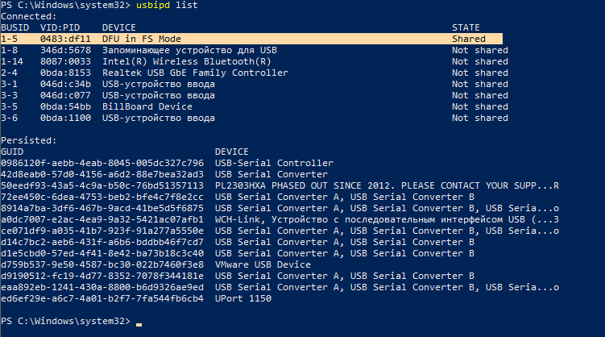

# miet-table software project

## Сборка и прошивка

Собрать:

```
make
```

Прошить:

```
make upload-dfu
```

Удалить артефакты сборки:

```
make clean
```

## Получение кода

Для работы с данным репозиторием нужен Linux или WSL. Если используется WSL, рекомендуется клонировать репозиторий в корневую папку пользователя (~/).

Установка требуемых пакетов:

```
sudo apt install gcc-arm-none-eabi make cmake dfu-util ninja-build
```

Клонирование репозитория (рекурсивно!):

```
git clone git@github.com:miet-tablet/miet-tablet-software.git --recursive
```

## Настройки для прошивки

Для прошивки через `dfu-util` требуется добавить USB устройство бутлоадера в группу plugdev, чтобы мочь прошиваться без root-прав.

```
sudo nano /etc/udev/rules.d/40-dfuse.rules
```

Далее, ввести:

```
# Example udev rules (usually placed in /etc/udev/rules.d)
# Makes STM32 DfuSe device writeable for the "plugdev" group

ACTION=="add", SUBSYSTEM=="usb", ATTRS{idVendor}=="0483", ATTRS{idProduct}=="df11", MODE="664", GROUP="plugdev", TAG+="uaccess"
```

Затем, необходимо перечитать настройки USB-устройств:

```
sudo udevadm control --reload-rules
sudo udevadm trigger
```

Если вы работаете с WSL, вам необходимо каждый раз для прошивки пробрасывать порт в WSL. Для этого требуется отдельно установить команду `usbipd` в Windows. Для проброса порта в WSL запускатся Powershell от имени администратора, затем запускается команда:

```
usbipd list
```



Смотрим `busid` (на фото 1-5). Затем выполняем команды:

```
usbipd bind --busid 1-5
```

```
usbipd attach --wsl --busid 1-5
```

Команду `usbipd bind` можно выполнить только один раз, а затем при каждом подключении устройства выполнять только `usbipd attach`.
